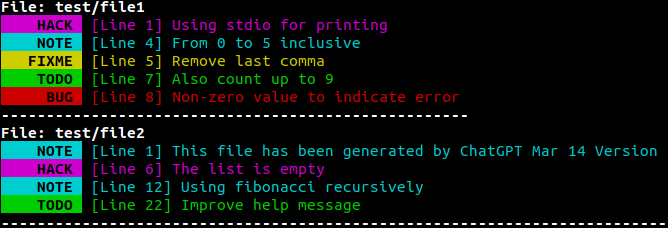

<div align="center" style="margin-bottom: 10px;">
<a href="https://github.com/raultapia/bethany">

</a>
</div>

<p align="center">
A command line tool to list all BUG, TODO, HACK, NOTE, and FIXME keywords in your code.
</p>

## ⚙️ Getting Started

```bash
git clone https://github.com/raultapia/bethany
cd bethany
sudo python3 setup.py install
```

In case you want to install only for the current user, replace last line by:
```bash
python3 setup.py install --user
```

## 🖥️ Usage
You can easily use `bethany` as follows:
```bash
bethany <filename>
```

For example, ``bethany test/file1 test/file2`` will return:



## 🔩 Options
#### Continuous mode
Continuous mode is enabled using flag ``-c`` or ``--continuous``. Headers and separators are removed from the output in continuous mode.

For example, ``bethany -c test/file1 test/file2`` will return:


## 📝 License

Distributed under the GPLv3 License. See `LICENSE` for more information.

## 📬 Contact

[Raul Tapia](https://github.com/raultapia) - raultapia@us.es
